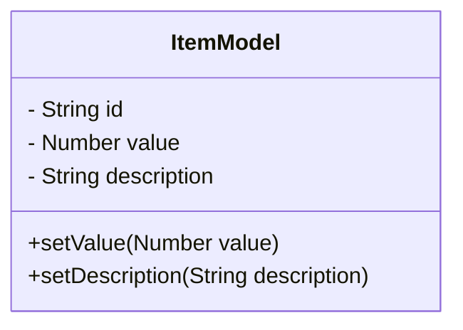
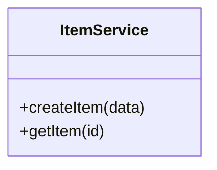
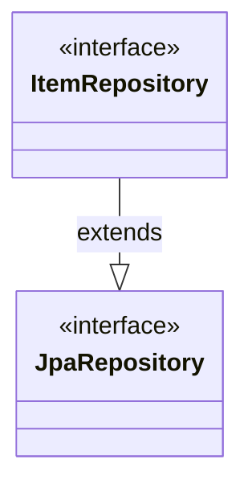
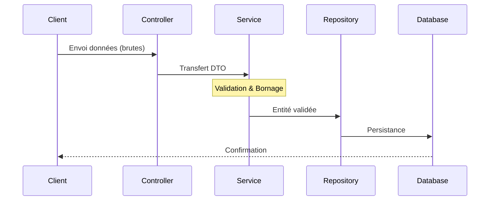

# Technical Spec : ItemModule

## 1. Objectif
Permettre au système de recevoir des données potentiellement mal formées et de les **borner** (validation et redressement) en cas de valeurs limites.

---

## 2. Solution

### Model
L'entité centrale porte la responsabilité de l'intégrité des données.

### Service
Le service orchestre la logique métier et applique les règles de "bornage" avant la persistance.

### Repository
L'interface de persistance utilisant l'abstraction JPA.

---

## 3. Flux de données
Représentation de la chaîne de responsabilité, de la réception à la sauvegarde.

